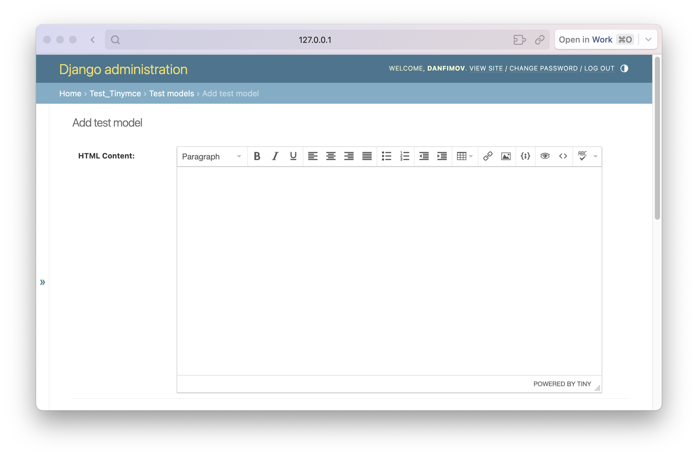

# django-tinymce4-plus

[](https://pypi.org/project/django-tinymce4-plus/)
[](https://pypi.org/project/django-tinymce4-plus/)


`django-tinymce4-plus` is a reworked fork of [django-tinymce4](https://github.com/dani0805/django-tinymce4). It provides a [TinyMCE 4](https://www.tinymce.com/) editor widget that can be used in Django forms and models.

In this fork, all legacy and broken code has been cleaned in order to provide a simple but full-featured TinyMCE 4 experience in Django projects.



## Installation

```bash
pip install django-tinymce4-plus
```

## Usage
In your code:

```python
from django.db import models
from tinymce import HTMLField

class MyModel(models.Model):
    ...
    content = HTMLField('Content')
```

In Django Admin the widget is used automatically for all models that have `HTMLField` fields. If you are using TinyMCE 4 in your website forms, add `form.media` variable into your templates:

```html
<!DOCTYPE html>
<html>
<head>
    ...
    {{ form.media }}
</head>
<body>
    ...
</body>
</html>
```

## Documentation

For more details see [documentation](https://danfimov.github.io/django-tinymce4-plus/).

## Useful links

- [django-tinymce4](https://github.com/dani0805/django-tinymce4);
- [TinyMCE 4](https://www.tinymce.com/);
- [django-filebrowser](https://github.com/sehmaschine/django-filebrowser);
- [django-filebrowser-no-grappelli](https://github.com/smacker/django-filebrowser-no-grappelli);
- [TinyMCE docs](https://www.tinymce.com/docs/).

## License

MIT license. See [LICENSE](https://github.com/danfimov/django-tinymce4-plus/blob/main/LICENSE)
